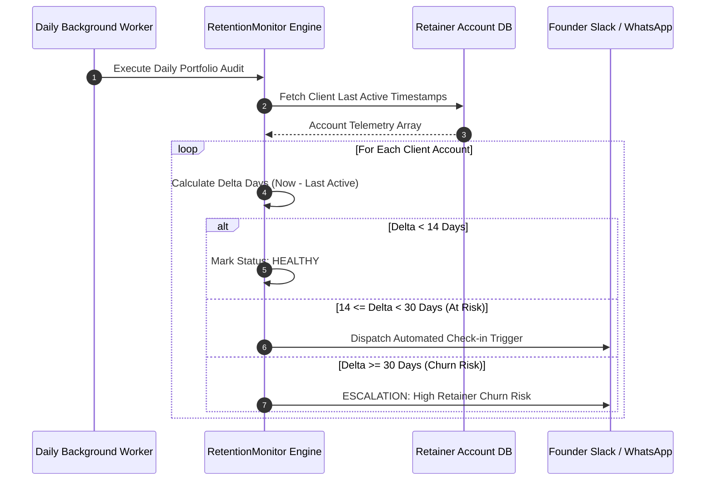

# ARCHITECTURE DOCUMENTATION
**Service:** Client Retention & Win-Back Engine  

## Background Auditing Engine
Designed to run as a daily background cron worker, it audits account inactivity deltas.

