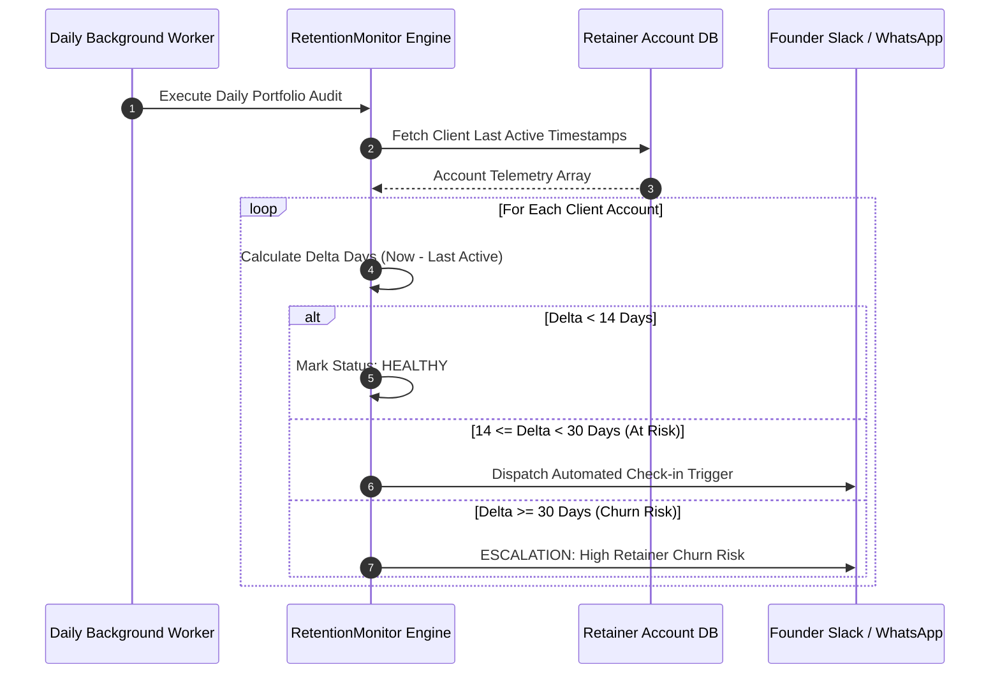

# Project 6: Client Retention & Win-Back Automation Engine
**Author:** Shashank Jha  
**Alignment:** Realates AI Systems (Core Service #6: Client Retention & Win-Back Automations)

---

## 1. Business Problem
In B2B AI agencies charging monthly retainers, silent client churn is a major risk. Clients rarely announce dissatisfaction; instead, they stop logging in. If an agency only discovers dissatisfaction at billing time, revenue is lost. Realates requires an automated radar system that monitors client engagement webhooks and proactively triggers win-back interventions.

## 2. Solution
The `client-retention-winback-engine` is an automated account auditing microservice. Designed to run as a daily cron job, it analyzes client telemetry records, calculates inactivity deltas against strict agency SLAs (14 days = `AT_RISK`, 30 days = `CHURNED`), and dispatches escalation alerts.

---

## 3. Architecture Diagram



---

## 4. Tech Stack
- **Language:** Python 3.11+
- **Validation:** Pydantic v2
- **Testing:** Pytest

---

## 5. Repository Structure
```text
6-client-retention-winback-engine/
├── Dockerfile
├── docker-compose.yml
├── requirements.txt
├── .env.example
├── README.md
├── ARCHITECTURE.md
├── DEPLOYMENT.md
├── tests/
│   └── test_monitor.py
└── src/
    ├── __init__.py
    ├── retention_monitor.py
    └── main.py
```

---

## 6. Setup Guide
```bash
cd portfolio/6-client-retention-winback-engine
cp .env.example .env
pytest tests/
python -m src.main
```
